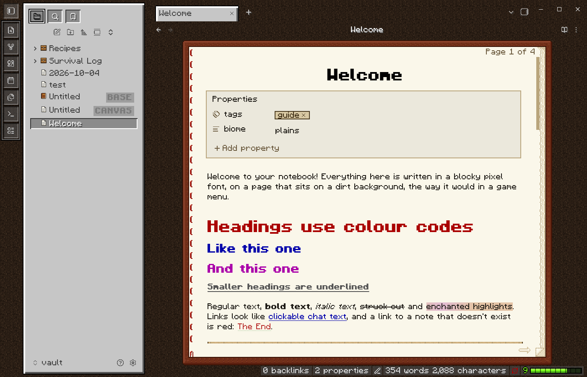
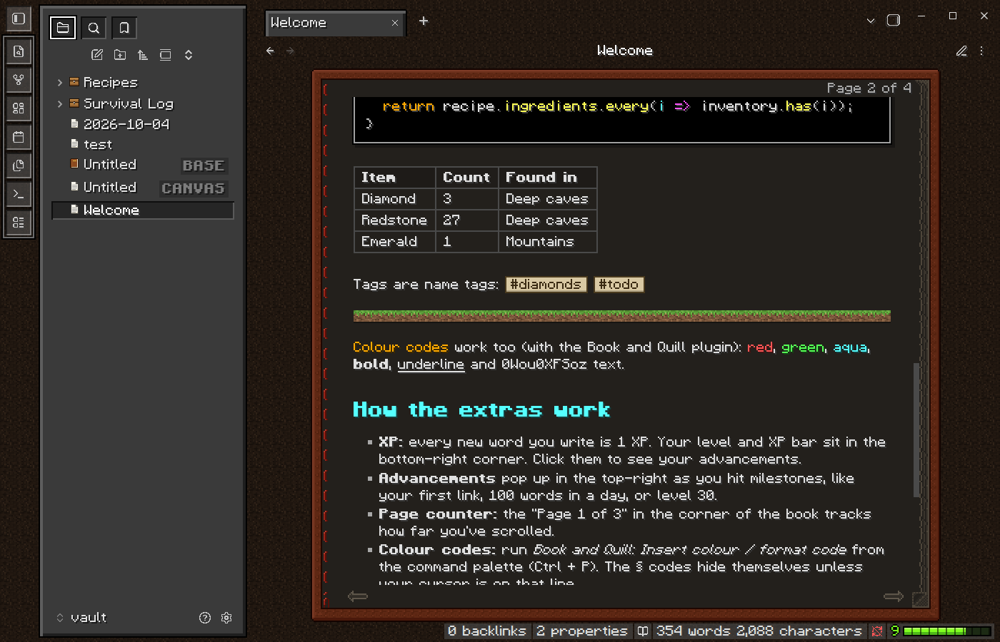

# Book and Quill

Take notes like you're writing in a blocky survival game. Your notes sit in a leather-bound book on a dirt background, framed by inventory-style panels and written in a pixel font.

## What it looks like

* **Pixel Quill:** an original 5×7 pixel font with bold, italic and monospace variants, embedded in the theme.
* **The book:** each note sits in a leather cover with rounded corners, red binding stitches, stacked page edges and a dog-eared corner. Light mode has cream pages; dark mode has dark pages with drop-shadowed text.
* **The world:** a darkened dirt background, like a game's options screen.
* **Inventory sidebars:** grey bevelled panels. The open file sits in a slot, and folders are chests that open when expanded.
* **Colour-coded headings:** headings use the game's colour palette, and links read like clickable chat text.
* **Inside your notes:** `==highlights==` shimmer like an enchantment, blockquotes are wooden signs, code is a black command-block field, tags are name tags and `---` is a strip of grass.
* **Game-style controls:** blocky buttons, toggles, sliders and scrollbars. Menus and tooltips look like item tooltips, and notices look like toasts.
* **Chat-bar prompts:** the command palette and quick switcher pop up from the bottom like the chat bar.
* **Title screen:** a new empty tab shows an **OBSIDIAN** logo in obsidian-block texture.

## Tips

* Keep the font size at **16** (Settings → Appearance), or 24/32. The pixel font is only perfectly crisp at multiples of 8.
* Both light and dark mode are supported.

## Companion plugin

The optional [Book and Quill plugin](https://github.com/smit4450/book-and-quill) adds:

* XP for every word you write, with a level and XP bar
* Advancement toasts
* A "Page 1 of 3" counter with page-turn arrows
* Splash text and rotating footer quips on the title screen
* § colour codes
* Click, page and level-up sounds

The theme works fine without it.

## Source

`theme.css` is generated from [smit4450/book-and-quill](https://github.com/smit4450/book-and-quill), which also holds the font and pixel-art generators. Please open issues there.

All textures, icons and the font are original pixel art made for this theme. Not affiliated with Mojang or Microsoft.
